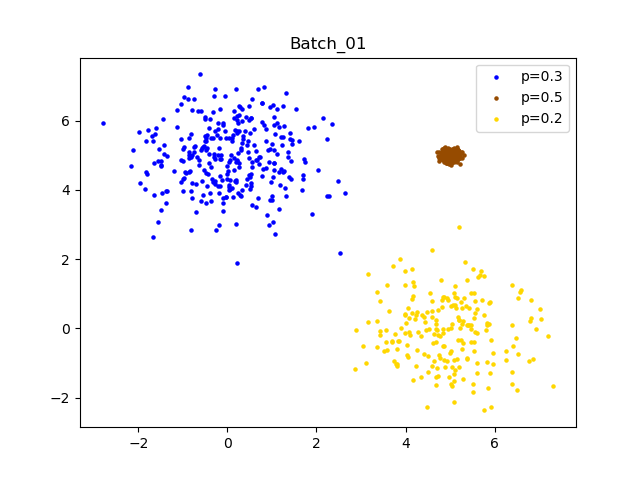

# Synthetic Data Generation with Gaussian Mixture Models

Synthetic data is a valuable asset for testing newly developed methods. This repository provides an implementation of a synthetic data generation algorithm in Python using Gaussian Mixture Models. 

## Table of Contents
- [Getting Started](#getting-started)
- [Usage Examples](#usage-examples)
- [Figures](#figures)
- [References](#references)

## Getting Started

### Installation

1. Clone this repository:

    ```shell
    git clone https://github.com/MekanMyradov/Simulations.git
    cd Simulations
    ```

2. Create and activate a conda environment:

    ```shell
    conda env create -f environment.yml
    conda activate simulate_batches
    ```


## Usage Examples

Here's an example of how to use the synthetic data generation code:
```python
from Batch import Batch
import numpy as np
import anndata as ad
import pandas as pd

np.random.seed(0)

# Create 2 batches with same means and standard deviations
x_mu = np.array([0, 5, 5])    # x means
x_sd = np.array([1, 0.1, 1])  # x standard deviations

y_mu = np.array([5, 5, 0])    # y means
y_sd = np.array([1, 0.1, 1])  # y standard deviations


# Weights of components
weights01 = np.array([0.30, 0.50, 0.20])    # fractions of cell types for batch 1
weights02 = np.array([0.65, 0.30, 0.05])    # fractions of cell types for batch 2


n_cells = 1000  # number of cells
n_genes = 100   # number of genes


# sample from standard normal distribution to project data to n_genes dimensional space.
proj = np.random.randn(n_genes * 2).reshape(n_genes, 2)

colors = np.array(["#0000FF", "#964B00", "#FFD700"])     # colors of components [blue, brown, gold] 

batch01 = Batch(
    x_mu=x_mu,
    x_sd=x_sd,
    y_mu=y_mu,
    y_sd=y_sd,
    weights=weights01,
    colors=colors,
    proj=proj,
    batch_id="Batch_01",
    n_cells=n_cells,
    n_genes=n_genes,
    gene_specific=False     # no need for gene specific noise (batch effect) in batch 1
)

batch02 = Batch(
    x_mu=x_mu,
    x_sd=x_sd,
    y_mu=y_mu,
    y_sd=y_sd,
    weights=weights02,
    colors=colors,
    proj=proj,
    batch_id="Batch_02",
    n_cells=n_cells,
    n_genes=n_genes,
    gene_specific=True     # employ gene specific noise (batch effect)
)

# Generate n_cells x 2 data
batch01.generate_data()
batch02.generate_data()

# Save the plot of low-dimensional data
batch01.save_clusters()
batch02.save_clusters()

# Projection
data01 = batch01.project_data()
data02 = batch02.project_data()

# Concatenate along axis 0 (rows)
data = np.concatenate((data01, data02), axis=0)

# Convert to AnnData
adata = ad.AnnData(data)

# Provide the index to both the 'obs' and 'var' axes
adata.var_names = ["Gene_{}".format(i) for i in range(0, adata.n_vars)]

obs01 = ["B01_Cell_{}".format(i) for i in range(0, batch01.n_cells)]
obs02 = ["B02_Cell_{}".format(i) for i in range(0, batch02.n_cells)]
adata.obs_names = np.concatenate((obs01, obs02), axis=0)

# Add some annotations to 'obs' (i.e., cells)
tech01 = pd.Categorical([batch01.batch_id] * batch01.n_cells)
tech02 = pd.Categorical([batch02.batch_id] * batch02.n_cells)
adata.obs["tech"] = np.concatenate((tech01, tech02), axis=0)

celltype01 = pd.Categorical(batch01.components)
celltype02 = pd.Categorical(batch02.components)
adata.obs["celltype"] = np.concatenate((celltype01, celltype02), axis=0)

adata.write("simulated_data.h5ad")
```

You can customize the parameters in the code to generate synthetic data for your specific use case.


## Figures

### Batch 1 has 3 components with proportions 0.3, 0.5, and 0.2.
<p align="center">

</p>

### Batch 2 has 3 components with proportions 0.65, 0.30, and 0.05.
<p align="center">

</p>


## References

[1] Haghverdi, Laleh, et al. "Batch effects in single-cell RNA-sequencing data are corrected by matching mutual nearest neighbors." Nature biotechnology 36.5 (2018): 421-427.